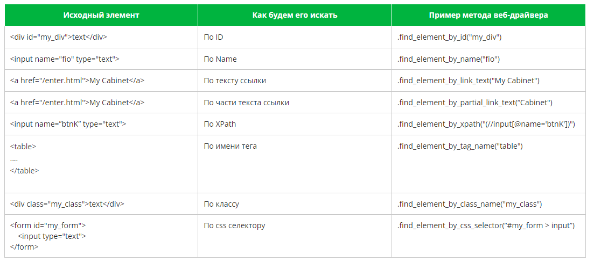

# Модуль 24

Веб-драйвер также позволяет нам найти элемент на странице разными путями:

- ID. Поиск элемента по указанному ID. Это лучший способ найти его, мы можем сразу перейти на нужный нам элемент без необходимости работать с окружающими или верхнеуровневыми элементами. Но есть одно «но»: возможна ситуация, когда ID элемента на странице будет неуникальным. 
- Class name: поиск элементов по имени класса. 
- Link text: поиск ссылки, содержащей определенный текст. 
- Partial link text: аналогично поиску по link text, но позволяет использовать “*” при частичном совпадении. 
- Name: все элементы, у которых есть имя (в наше время мало сайтов используют это свойство, поэтому эта стратегия не самая популярная). 
- Tag name: поиск по тэгу. 
- CSS selector: поиск элементов со специализированным css-style запросом. 
- XPath: поиск по запросу xpath.




После получения элемента мы можем осуществить с ним различные действия (в зависимости от типа элемента). Приведем для примера несколько методов:
.click() — осуществляет клик левой кнопкой мыши в центр элемента. Не принимает параметры и ничего не возвращает. Элемент, по которому осуществляется нажатие, должен быть видим.
.clear() — метод влияет только на поля ввода input и textarea и стирает весь текст внутри поля.
.send_keys(“text”) — вводит заданную строку в текстовое поле. Для ввода кириллицы необходимо указывать строку вида u”Русский язык”.
.submit() — инициирует отправку формы (аналогично нажатию Enter при выбранном поле ввода внутри формы).

[Список методов Selenium для веб-элементов](https://www.selenium.dev/selenium/docs/api/py/webdriver_remote/selenium.webdriver.remote.webelement.html)
Расширенный набор методов библиотеки pytest-selenium для работы с веб-элементами [тут](https://selenium-python.readthedocs.io/api.html)

## 24.6. Методы управления браузером и фикстуры
### Фикстуры для Chrome
```python
import pytest
@pytest.fixture
def chrome_options(chrome_options):
    chrome_options.binary_location = '/path/to/chrome'
    chrome_options.add_extension('/path/to/extension.crx')
    chrome_options.add_argument('--kiosk')
    return chrome_options
```
Где:
chrome_options.binary_location — путь к exe браузера (включая сам исполняемый файл).
chrome_options.add_extension — включение дополнений браузера.
Через метод chrome_options.add_argument() можно задавать другие параметры запуска браузера из [списка](https://peter.sh/experiments/chromium-command-line-switches/)

Чтобы добавить более глубокий уровень логирования:
```python
import pytest
@pytest.fixture
def driver_args():
    return ['--log-level=LEVEL']
```

Режим запуска без пользовательского интерфейса, с так называемым headless-режимом («без головы»)
```python
import pytest
@pytest.fixture
def chrome_options(chrome_options):
    chrome_options.set_headless(True)
    return chrome_options
```
Иногда нам нужно произвести какие-либо дополнительные действия с драйвером или браузером используя методы библиотеки 
Selenium до или после тестов, не прибегая к заданию аргументов. Тогда мы должны создать свою фикстуру, использующую фикстуру Selenium.
В нашем примере мы будем до теста задавать определённые размеры окна браузера, а после теста, в случае его падения, менять цвет фона для контрастности и делать скриншот. Цвет фона мы будем менять при помощи команды javascript, а исполняет эту команду метод browser.execute_script(). 
Кроме того, у нас будут выведены в системную консоль логи из консоли веб-браузера (той, которая появляется при нажатии F12). 
Для этого используется метод browser.get_log('browser').

Для того, чтобы в нашей фикстуре мы узнали, как именно завершился тест (удачно или нет), 
ы используем способ, который в официальных рекомендациях к pytest называется ["Making test result information available in fixtures".](https://docs.pytest.org/en/stable/example/simple.html) 
Для этого мы добавляем вначале функцию pytest_runtest_makereport, которая добавляет к объекту request информацию о результатах теста. 
Сейчас мы не будем подробно останавливаться на содержании этой функции, но оно стандартно и может быть использовано «как есть».
Главное, что мы должны вынести для себя — это возможность использовать проверку переменной request.node.rep_call.failed. 
Не забывайте добавлять объект request ко входящим параметрам вашей фикстуры.
```python
#content of file conftest.py

import pytest
import uuid


@pytest.hookimpl(hookwrapper=True, tryfirst=True)
def pytest_runtest_makereport(item, call):
    # This function helps to detect that some test failed
    # and pass this information to teardown:

    outcome = yield
    rep = outcome.get_result()
    setattr(item, "rep_" + rep.when, rep)
    return rep

@pytest.fixture
def web_browser(request, selenium):

    browser = selenium
    browser.set_window_size(1400, 1000)

    # Return browser instance to test case:
    yield browser

    # Do teardown (this code will be executed after each test):

    if request.node.rep_call.failed:
        # Make the screen-shot if test failed:
        try:
            browser.execute_script("document.body.bgColor = 'white';")

            # Make screen-shot for local debug:
            browser.save_screenshot('screenshots/' + str(uuid.uuid4()) + '.png')

            # For happy debugging:
            print('URL: ', browser.current_url)
            print('Browser logs:')
            for log in browser.get_log('browser'):
                print(log)

        except:
            pass # just ignore any errors here
```

